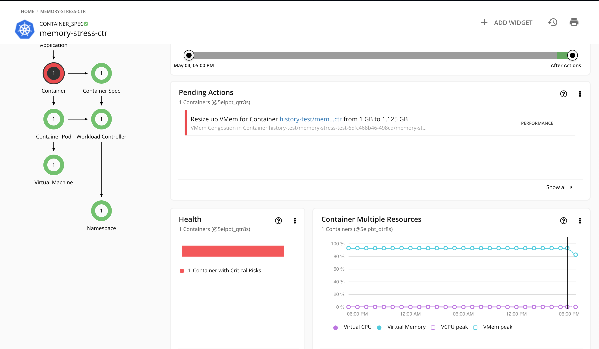
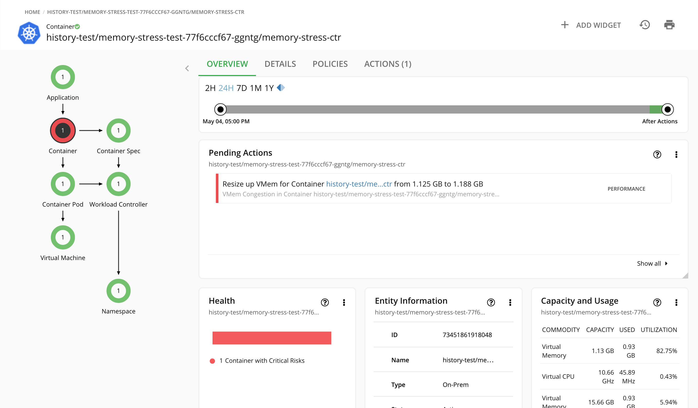
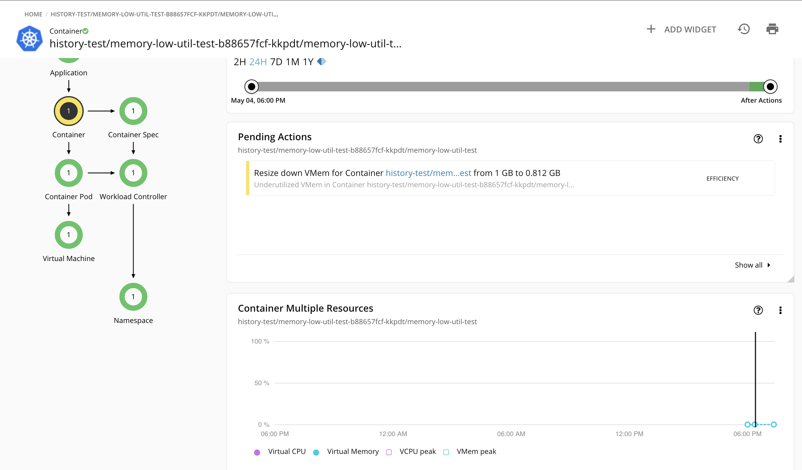
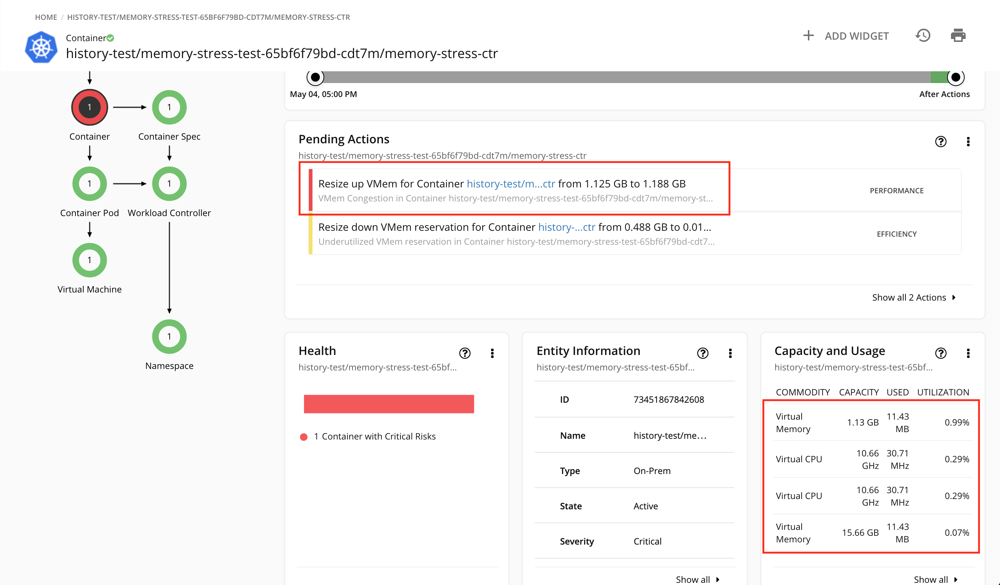
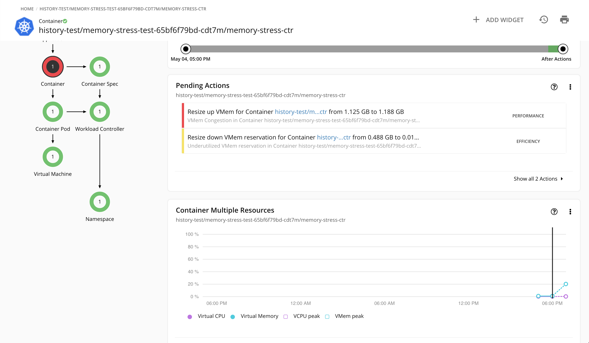
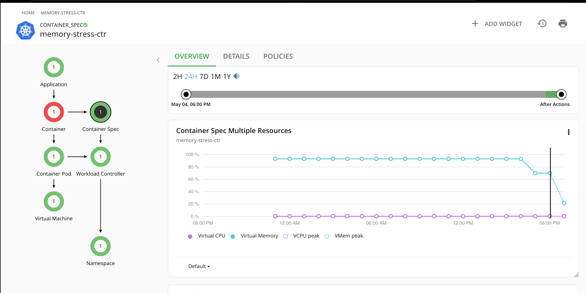

# Container Resizing with Historical Utilization
This scenario tests the Container resizing by taking historical utilization into consideration.

Container resizing should respect historical utilization. Starting from 7.22.0, Turbonomic analysis uses historical 95th percentile utilization data to recommend Container resize actions. Here resizing refers to vertical resizing of CPU and memory.

A scenario is created here where:
1. A container is initialized with high memory utilization and resize up action should be generated.
2. Keep the container running long enough time (over a day)
3. Execute the resize up action to restart the Container and the new Container is in low Utilization.

**Expectation**:

Prior to Turbonomic 7.22.0, this Container will be resized down due to current low utilization.

In Turbonomic 7.22.0, even though current utilization is low, this Container will not be resized down and instead could be resized up because of historical high utilization.

## Testing Results

#### 1. Create a Container with high memory utilization (over 90%)

```console
➜  history-test git:(master) ✗ kubectl apply -f init_high_mem_utilization_container.yaml
namespace/history-test created
deployment.apps/memory-stress-test created
```

This creates a Container with memory.limit = 1G and memory usage = 950 Mb (93% utilization). And a resize up aciton was generated:


#### 2. Keep the container running for almost the whole day to make sure the historical 95th percentile utilization is high

#### 3. Execute the resize up action (memory from 1GB to 1.125GB) and a new resize up is generated:


#### 4.  Manually modify the memory usage of the container to a very low number to reduce the memory utilization below 1%.

```console
➜  history-test git:(master) ✗ kubectl apply -f 2_mem_stress_deployment.yaml
deployment.apps/memory-stress-test configured
```

#### 5. Change the resizeDownWarmUpIntervalHours property to 0 so that resize down action can be instantly generated for low utilization without waiting over 4 hours.

Add this property to `charts_v1alpha1_xl_cr.yaml` of the Turbonomic server:
```yaml
  properties:
    topology-processor:
      resizeDownWarmUpIntervalHours: 0
```

Then
```console
[turbo@node1 crds]$ kubectl apply -f charts_v1alpha1_xl_cr.yaml
xl.charts.helm.k8s.io/xl-example configured
```

#### 6. Verify resize down action could be instantly generated for a low utilization Container without the warm up interval

Creates another Container with memory utilization lower than 1% and after TP broadcast and Market analysis, a resize down action was generated without historical data:
```console
➜  history-test git:(master) ✗ kubectl apply -f 3_low_mem_deployment.yaml
deployment.apps/memory-low-util created
```


#### 7. Back to the Container we care about, after rediscovery and triggering TP broadcast and wait until market analysis finished, no resize down action was generated, instead a resize up was recommended even with very low current memory utilization:



#### 8. We lost the history data of the container instance due to the restart



#### 9. But we are still showing the historical data when scoping to the corresponding ContainerSpec entity, which could explain the resize up action

